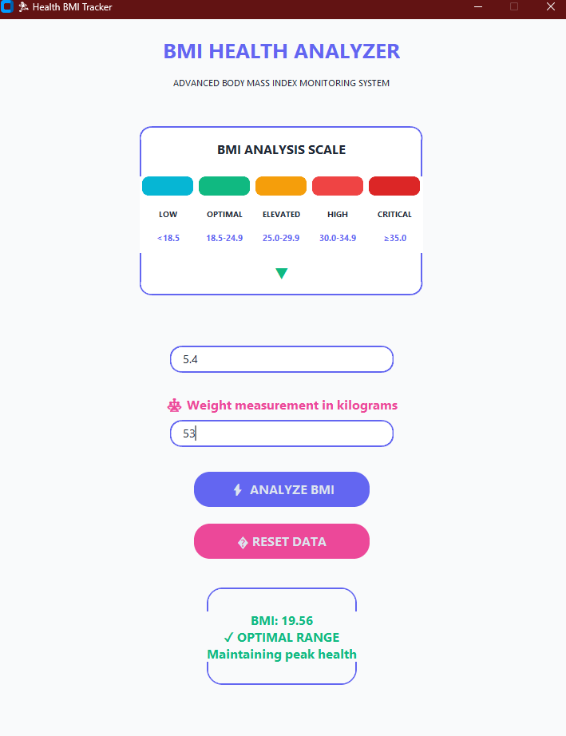

# 🏃‍♂️ Health BMI Tracker

A modern, clean BMI (Body Mass Index) calculator built with Python and customtkinter. Features a light, professional design with intuitive user interface and real-time health feedback.

## ✨ Features

- **Modern Light UI** - Clean, professional design with contemporary colors
- **Health-Focused** - Color-coded BMI categories with health advice
- **Input Validation** - Smart error handling with helpful messages
- **Responsive Design** - Beautiful card-based layout
- **Easy to Use** - Simple, intuitive interface
- **Portable** - Can be compiled to standalone executable

## 📸 Screenshots



## 🚀 Installation

### Prerequisites
- Python 3.7+
- pip package manager

### Setup
1. Clone the repository:
```bash
git clone https://github.com/yourusername/Health-BMI-Tracker.git
cd Health-BMI-Tracker
```

2. Install required packages:
```bash
pip install -r requirements.txt
```

3. Run the application:
```bash
python "-BMI- Calculator.py"
```

## 📊 BMI Categories

The app provides color-coded feedback based on standard BMI ranges:

| Category | BMI Range | Color | Advice |
|----------|-----------|-------|--------|
| Underweight | < 18.5 | � Cyan | Need more nutrition! |
| Healthy Weight | 18.5 - 24.9 | 💚 Green | Keep it up! |
| Overweight | 25.0 - 29.9 | � Amber | Consider exercise |
| Obese | 30.0 - 34.9 | 🧡 Orange | Consult a doctor |
| Severely Obese | ≥ 35.0 | ❤️ Red | Seek medical help |

## 📦 Building Executable

To create a standalone executable using PyInstaller:

```bash
pip install pyinstaller
pyinstaller --onefile --windowed "-BMI- Calculator.py"
```

## 🛠️ Tech Stack

- **Python** - Core programming language
- **customtkinter** - Modern GUI framework
- **PIL (Pillow)** - Image processing
- **tkinter** - Base GUI framework

## 🎨 Design Features

- Light theme with professional color palette
- Card-based result display
- Modern button styling with icons
- Responsive input fields with focus indicators
- Clean typography using Segoe UI font

## 🤝 Contributing

Contributions are welcome! Feel free to:
- Report bugs
- Suggest new features
- Submit pull requests
- Improve documentation

## 📄 License

This project is open source and available under the [MIT License](LICENSE).
